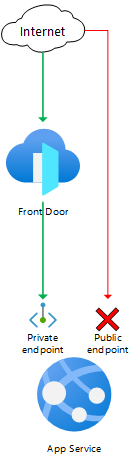
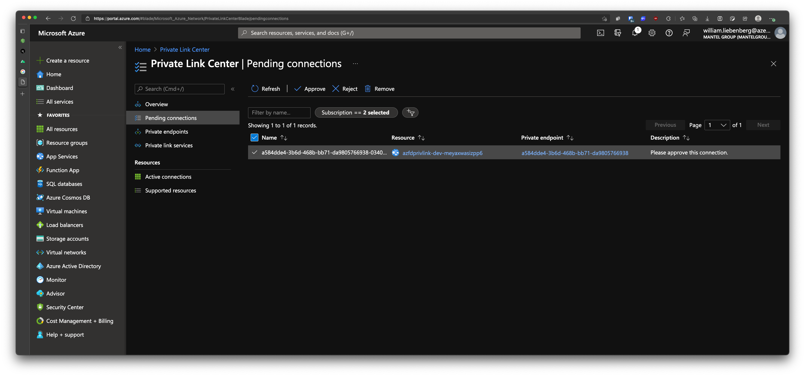
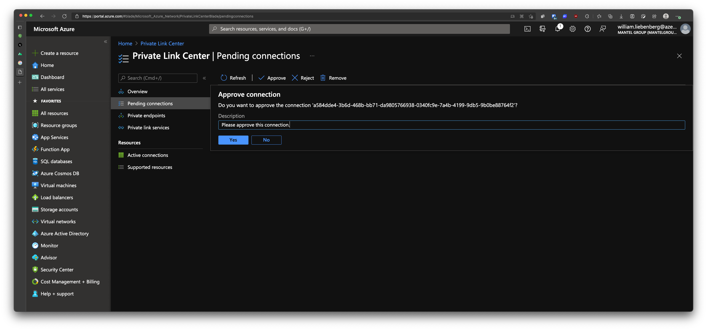
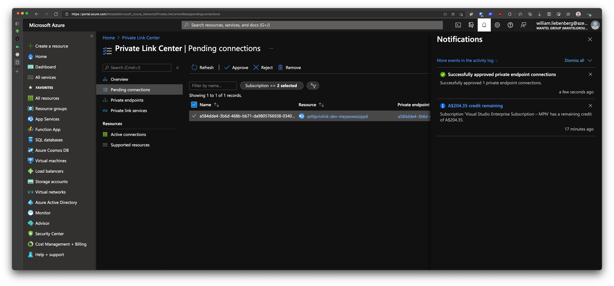
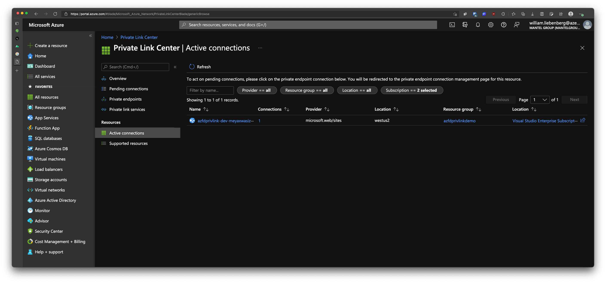
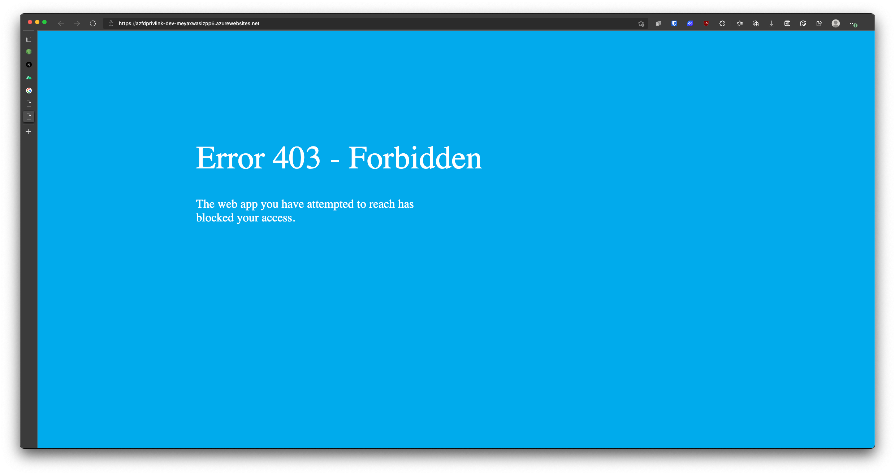
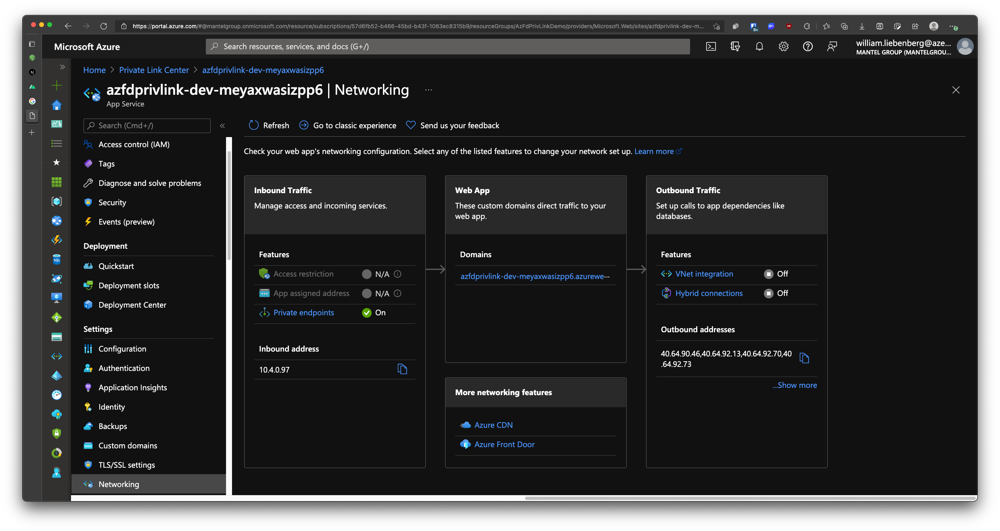
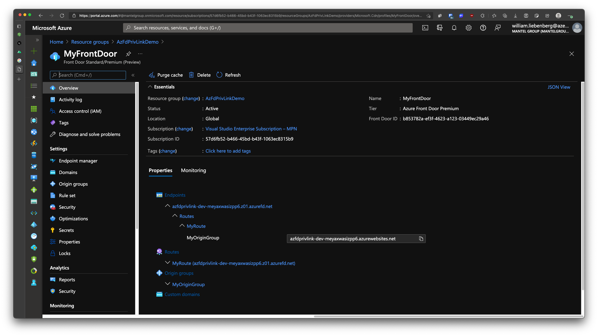
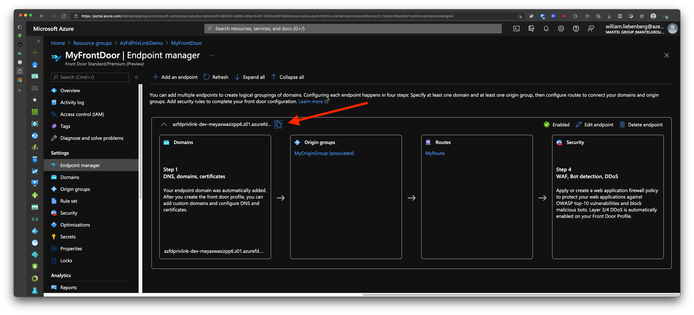
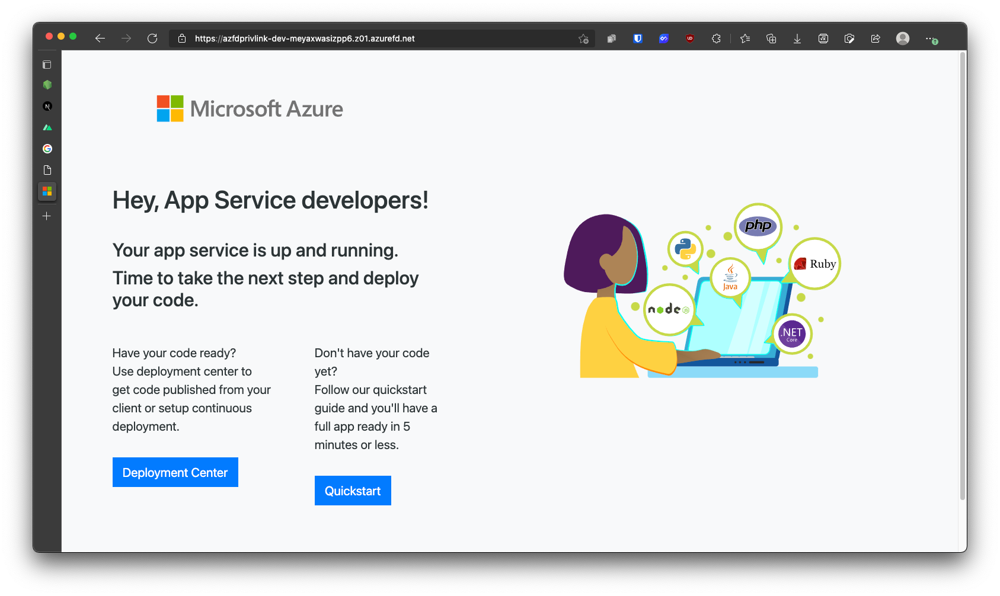

# Front Door Standard/Premium (Preview) with App Service origin and private endpoint

> (origin sample obtained from: https://github.com/Azure/azure-quickstart-templates/tree/master/quickstarts/microsoft.network/front-door-premium-app-service-private-link)

This template deploys a Front Door Standard/Premium (Preview) with an App Service origin, using a private endpoint to access the App Service application.

## Sample overview and deployed resources

This sample template creates an App Service app and a Front Door profile, and uses a private endpoint (also known as Private Link) to access the App Service.

The following resources are deployed as part of the solution:

### App Service

- App Service plan and application.
- The App Service plan must use a [SKU that supports private endpoints](https://docs.microsoft.com/azure/app-service/networking/private-endpoint).

### Front Door Standard/Premium (Preview)

- Front Door profile, endpoint, origin group, origin, and route to direct traffic to the App Service application.
- This sample must be deployed using the premium Front Door SKU, since this is required for Private Link integration.
- The Front Door origin is configured to use Private Link. The behaviour of App Service (as of February 2021) is that, once a private endpoint is configured on an App Service instance, [that App Service application will no longer accept connections directly from the internet](https://docs.microsoft.com/azure/app-service/networking/private-endpoint). Traffic must flow through Front Door for it to be accepted by App Service.

The following diagram illustrates the components of this sample.



## Deployment steps

You can click the "deploy to Azure" button at the beginning of this document or follow the instructions for command line deployment using the scripts in the root of this repo.

## Usage

### Connect

Once you have deployed the Azure Resource Manager template, you need to approve the private endpoint connection. This step is necessary because the private endpoint created by Front Door is deployed into a Microsoft-owned Azure subscription, and cross-subscription private endpoint connections require explicit approval. To approve the private endpoint:
1. Open the Azure portal and navigate to the App Service application.
2. Click the **Networking** tab, and then click **Configure your private endpoint connections**.
3. Select the private endpoint that is awaiting approval, and click the **Approve** button. This can take a couple of minutes to complete.

After approving the private endpoint, wait a few minutes before you attempt to access your Front Door endpoint to allow time for Front Door to propagate the settings throughout its network.

You can then access the Front Door endpoint. The hostname is emitted as an output from the deployment - the output is named `frontDoorEndpointHostName`. You should see an App Service welcome page. If you see an error page, wait a few minutes and try again.

You can also attempt to access the App Service hostname directly. The hostname is also emitted as an output from the deployment - the output is named `appServiceHostName`. You should see a _Forbidden_ error, since your App Service instance no longer accepts requests that come from the internet.

## Notes

- Front Door Standard/Premium is currently in **preview**. DO NOT USE FOR PRODUCTION SITES!
- When using Private Link origins with Front Door Premium during the preview period, [there is a limited set of regions available for use](https://docs.microsoft.com/en-us/azure/frontdoor/standard-premium/concept-private-link#limitations). These have been enforced in the template. Once the service is generally available this restriction will likely be removed.
- Front Door Standard/Premium is not currently available in the US Government regions.

---

# My contributions

## Infrastructure Deployment

1. Ensure you have run `az login` and selected the correct tenant & subscription
2. From the `.azure` folder, run the `deploy.ps1` script with your appropriate parameters
3. Wait for the resources to be provisioned - have a coffee ☕️

Example execution of `deploy.ps1`

```ps1
./deploy.ps1 -resourceGroup "AzFdPrivLinkDemo" `
    -location "westus2" `
    -projectName "AzFdPrivLink" `
    -environmentName "dev" `
    -bicepFile bicep/main.bicep `
    -bicepParametersFile main.parameters.dev.json
```

### Results

Running the BICEP deployment:


Go to Azure Portal -> Private Link Center



Approve the Pending Connection:
> Oops I forgot to add a description to the connection 😀


Wait for the connection activation to be approved:



Go to Private Link Center | Active connections:



Go to the AppService link (https://azfdprivlink-dev-meyaxwasizpp6.azurewebsites.net/) -> You will get Error 403 Forbidden



App Service -> Networking tab -> Private Endpoints is **On**:



Goto Front Door in your Resource Group


Goto Front Door -> Endpoint Manager -> Copy Link (https://azfdprivlink-dev-meyaxwasizpp6.z01.azurefd.net):



Open Link:



BOOM!

## Deploying binaries to the AppService

Since you will no longer have public access to the AppService webapp, the usual deployment tasks (GitHub Actions `azure/webapps-deploy@v2` / Azure DevOps `AzureWebApp@1`/`AzureRmWebAppDeployment@4`) will fail.

You can however still deploy and update the webapp using an Azure Storage Account and the `WEBSITE_RUN_FROM_PACKAGE` appsetting. 

Upload the application artifact ZIP file to the storage account blob container and set the `WEBSITE_RUN_FROM_PACKAGE` value as a URL pointing to the ZIP file blob.

To secure access to the application ZIP blob:

1. remove public access to the blob container
2. enable Manage Identity / System Assigned Identity for the AppService webapp
3. assign the `Storage Blob Data Reader` role to the AppService webapp (from the storage account Access Control (IAM) blade)

To deploy the application:

1. (optional) - edit the `zip-deploy.ps1` script and modify the default input parameters 
2. run the `zip-deploy.ps1` script from repository root folder
3. open the application hosted by Front Door e.g. https://azfdprivlink-dev-meyaxwasizpp6.z01.azurefd.net

DONE!